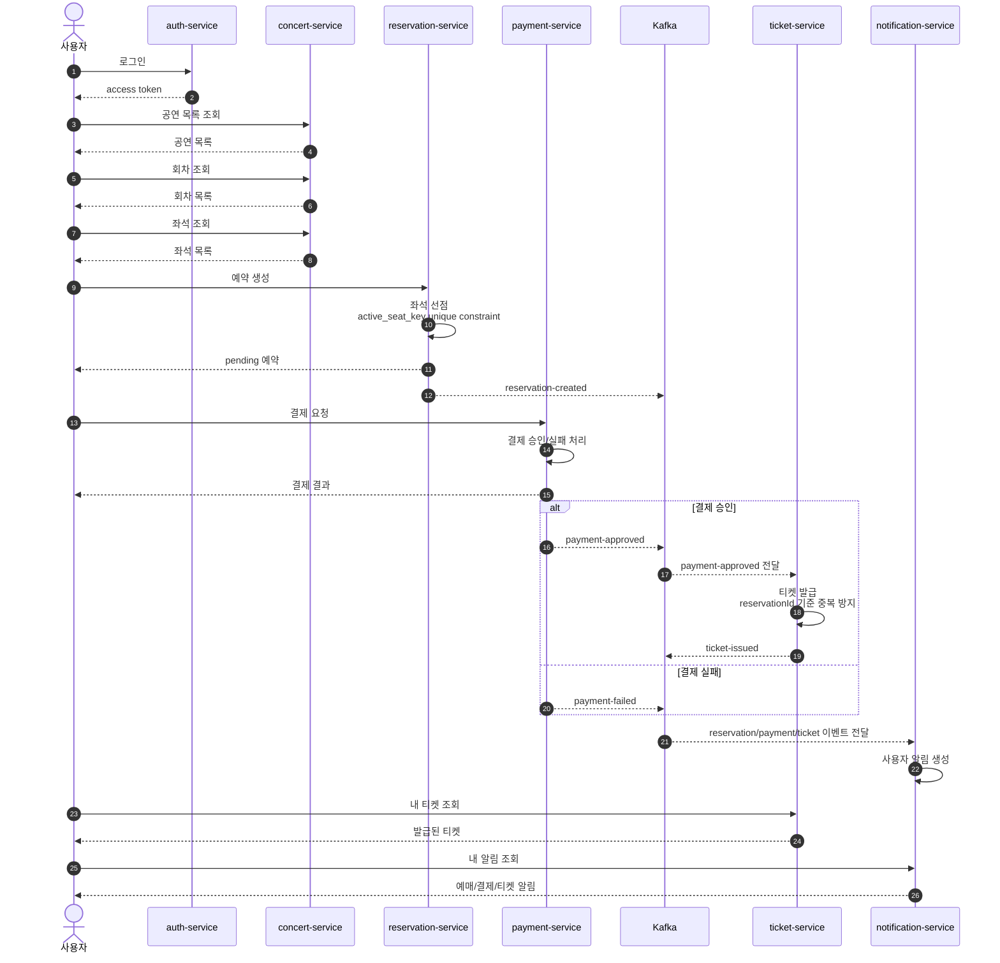
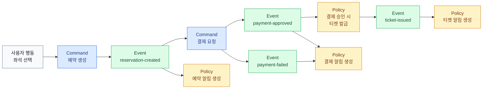

# 사용자 예매 흐름

이 문서는 사용자가 공연을 조회하고 좌석을 선택한 뒤 예약, 결제, 티켓 발급, 알림까지 이어지는 흐름을 한 곳에서 보기 위한 기준 문서다.

실제 이벤트 토픽명과 payload 모델은 `packages/contracts/src/contracts/events.py`를 기준으로 한다. 이 문서는 흐름과 서비스 책임을 설명하고, 계약의 세부 필드를 중복 정의하지 않는다.

## 시퀀스

## 이벤트 흐름

## 이벤트 요약

| topic | producer | consumers | 목적 |
| --- | --- | --- | --- |
| `reservation-created` | `reservation-service` | `notification-service` | 예약 생성 사실을 알림으로 남긴다. |
| `reservation-expired` | `reservation-service` | `notification-service` | 결제 시간 만료로 예약이 풀렸음을 알린다. |
| `payment-approved` | `payment-service` | `ticket-service`, `notification-service` | 결제 승인 후 티켓 발급과 결제 완료 알림을 시작한다. |
| `payment-failed` | `payment-service` | `notification-service` | 결제 실패 알림을 생성한다. |
| `ticket-issued` | `ticket-service` | `notification-service` | 티켓 발급 완료 알림을 생성한다. |

## 현재 구현 메모

- `reservation-service`는 DB unique constraint로 같은 회차/좌석의 중복 active 예약을 막는다.
- `ticket-service`는 `payment-approved` 이벤트를 소비해 티켓을 발급할 수 있고, `reservationId` 기준 중복 발급을 막는다.
- `notification-service`는 예약, 결제, 티켓 이벤트를 받아 알림을 만들 수 있다.
- 전체 사용자 예매 E2E를 안정적으로 만들려면 `payment-service`의 이벤트 payload와 Kafka 발행, 그리고 E2E Compose의 결제/티켓 서비스 구성이 먼저 정렬되어야 한다.
