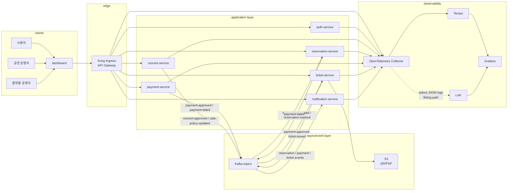
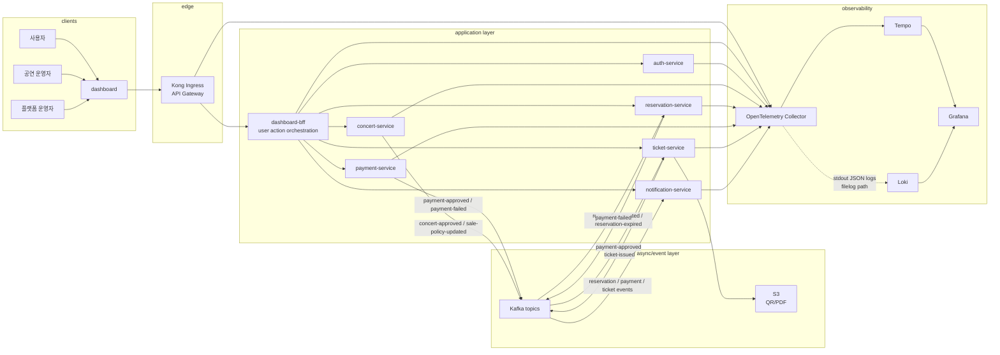

# Trace 설계 기준

이 문서는 `service` repo의 Python/FastAPI 서비스에서 OpenTelemetry trace를 어떤 기준으로 적용할지 정리한다.

목표는 모든 함수 호출을 trace로 나열하는 것이 아니다. 운영자가 장애와 지연을 분석할 때 요청, 에러, Kafka 이벤트, 로그를 같은 흐름 안에서 찾을 수 있도록 공통 경계를 먼저 계측한다.

## 결론

Python/FastAPI 서비스에서는 Go처럼 모든 함수가 error를 반환하고 `Wrap(err)`로 정보를 누적하는 방식을 강제하기 어렵다. Python의 예외 전파는 함수 선언에 드러나지 않고, 개발자별 규율에 크게 의존한다.

따라서 trace v1은 자동화 가능한 경계부터 적용한다.

- FastAPI inbound 요청은 공통 instrumentation으로 span을 자동 생성한다.
- 비즈니스 서비스 레이어는 OpenTelemetry를 직접 import하지 않는다.
- 예외 컨텍스트는 특정 `AppError` 클래스 강제가 아니라 독립 `packages/errors`의 context contract로 전파한다.
- 공통 exception handler가 current span과 structured log에 에러 정보를 한 번만 기록한다.
- 관측성 코드는 `packages/server`가 아니라 별도 `packages/observability`로 분리한다.
- `packages/errors`는 OpenTelemetry, FastAPI, structlog, Sentry에 의존하지 않는다.
- Kafka와 HTTP 전파는 payload가 아니라 protocol header에서 처리한다.
- dashboard가 여러 서비스를 직접 호출하는 사용자 행동 연결은 별도 정책으로 남긴다. `client_action_id`는 아직 span attribute 표준에 넣지 않는다.

## 개념 구분

Trace와 stack trace는 다른 개념이다.

```text
trace
  - 여러 서비스와 비동기 처리에 걸친 요청 흐름
  - trace_id, span_id, parent/span link로 구성
  - Tempo/Grafana에서 서비스 간 흐름과 지연을 본다

stack trace
  - 한 프로세스 안에서 예외가 발생한 코드 경로
  - Python traceback 또는 exception chain으로 보존
  - 로그와 span exception event로 기록한다

request_id
  - HTTP 요청 단위 correlation id
  - 외부 응답, 로그 조회, 고객 문의 대응에 사용한다

business id
  - reservation_id, payment_id, ticket_id, event_id 같은 업무 식별자
  - trace 전파 수단이 아니라 검색과 업무 상태 대조용 attribute다
```

## 전체 서비스 아키텍처

Trace 설계는 서비스 내부 코드만이 아니라 외부 진입점, dashboard 호출 방식, Kafka 이벤트 흐름을 함께 본다. API Gateway 역할은 Kong Ingress를 우선 활용하고, 사용자 행동 단위 orchestration이 커지면 BFF를 둘 수 있다.

### BFF 없는 현재 구조

현재 구조에서는 dashboard가 Kong Ingress를 통해 각 FastAPI 서비스를 직접 호출한다. Kong은 edge 요청 단위 trace를 만들고 upstream 서비스로 trace context를 전달할 수 있지만, dashboard의 여러 API 호출을 하나의 사용자 행동으로 자동 묶지는 않는다.



### BFF 적용 구조

BFF를 도입하면 dashboard는 Kong을 통해 `dashboard-bff`를 호출하고, BFF가 화면 또는 사용자 행동 단위 API를 제공한다. BFF는 여러 서비스 호출을 조합하면서 backend trace root와 `client_action_id`를 일관되게 관리할 수 있다.



BFF 없는 구조에서는 백엔드 FastAPI 계측만으로 “좌석 선택 -> 예약 -> 결제 -> 티켓 발급” 전체가 자동으로 하나의 trace가 되지 않는다. dashboard가 각 서비스를 독립 HTTP 요청으로 호출하기 때문이다.

따라서 v1에서는 각 서비스 요청을 안정적으로 trace/log와 연결하고, 사용자 행동 전체 correlation은 별도 설계로 둔다.

## 적용 원칙

### 1. boundary-first

trace는 개발자가 모든 함수에 수동으로 심는 기능이 아니다. 공통 경계에서 자동으로 수집한다.

우선 적용 경계는 다음과 같다.

- FastAPI request boundary
- common exception handler
- Kafka producer/consumer adapter
- HTTP client adapter 또는 instrumentation
- DB driver instrumentation

비즈니스 서비스 레이어는 기본적으로 trace를 모른다. 필요한 경우 `TraceRecorder` facade로 제한된 수동 trace만 남긴다.

```text
허용
  packages/observability/src/observability/config.py
  packages/observability/src/observability/fastapi.py
  packages/observability/src/observability/logging.py
  packages/observability/src/observability/tracing.py
  packages/observability/src/observability/propagation.py
  packages/errors/src/errors/context.py
  packages/errors/src/errors/builder.py
  packages/errors/src/errors/exceptions.py
  services/*/app/main.py
  services/*/app/observability.py
  services/*/app/kafka.py
  services/*/app/consumers/*.py
  services/*/app/exceptions.py

비허용
  services/*/app/services/*.py 에서 opentelemetry 직접 import
  services/*/app/repositories/*.py 에서 trace_id 직접 전달
  request/response body에 trace_id 필드 추가
```

### 2. attribute-first

새 span을 만들기 전에 현재 span에 의미 있는 attribute를 붙이는 것을 우선한다.

좋은 attribute 후보:

- `app.use_case`
- `error.code`
- `error.domain`
- `event.type`
- `event.topic`
- `reservation.id`
- `payment.id`
- `ticket.id`

피해야 할 attribute:

- raw JWT
- email, phone, address
- payment token
- large payload
- high-cardinality 값을 metric label 또는 Loki label로 승격하는 것

### 3. manual-trace-facade

서비스 코드가 OpenTelemetry API를 직접 import하지 않도록 `packages/observability`는 `TraceRecorder` facade를 제공한다. 이 facade는 OpenTelemetry 교체용 추상화가 아니라, 서비스 코드에서 허용되는 수동 trace 사용 규칙을 좁히는 포트다.

허용 API:

```text
trace.attribute(key, value)
trace.event(name, attributes)
trace.span(name)
```

사용 기준:

- 기본은 `attribute()`다. 현재 request span 또는 child span에 검색 가능한 업무 식별자를 붙인다.
- `event()`는 좌석 점유 생성, 결제 승인 수신처럼 운영자가 흐름에서 보고 싶은 중요한 순간에만 쓴다.
- `span()`은 시간을 따로 보고 싶은 주요 단계에만 쓴다. 모든 service method에 decorator로 붙이지 않는다.
- `TraceRecorder`는 span을 필드에 저장하지 않고 호출 시점마다 current span을 조회한다.
- current span이 없거나 invalid이면 조용히 no-op 한다.
- attribute/event 값은 `str`, `int`, `float`, `bool` 또는 그 sequence만 허용한다.

금지 기준:

- `services/*/app/services/*.py`에서 `opentelemetry` 직접 import
- raw JWT, email, phone, address, payment token, 큰 payload 기록
- loop 안에서 item마다 span 생성
- 전체 서비스 method에 일괄 decorator 적용
- metric label 또는 Loki label로 올릴 수 없는 고카디널리티 값을 metric/log label로 승격

예시:

```python
from observability import TraceRecorder, trace_recorder


class ReservationCommandService:
    def __init__(self, trace: TraceRecorder | None = None) -> None:
        self.trace = trace or trace_recorder()

    def reserve_seat(self, reservation_id: str, seat_id: str) -> None:
        trace = self.trace
        trace.attribute("app.use_case", "reserve_seat")
        trace.attribute("reservation.id", reservation_id)

        with trace.span("reservation.reserve_seat"):
            create_hold(seat_id)
            trace.event("seat.hold.created", {"seat.id": seat_id})
```

### 4. exception-context-first

Python에서는 Go처럼 error wrapping을 모든 함수에 강제하지 않는다. 대신 `samber/oops`의 builder/context 모델을 참고해 기존 예외에 context를 누적할 수 있는 독립 패키지를 둔다.

이 패키지는 에러 핸들링 프레임워크가 아니다. 예외에 대한 컨텍스트를 전파하는 도구다. 특정 base class 이름을 강제하지 않고, 공통 handler가 읽을 수 있는 context shape만 제공한다.

```text
exception context contract
  - code: 사람이 검색할 수 있는 안정적인 에러 코드
  - domain: auth, concert, reservation, payment, ticket, notification
  - message: 운영 로그에 쓸 내부 메시지
  - public_message: 외부 응답에 노출 가능한 메시지
  - tags: feature, dependency, retry 같은 분류 태그
  - attributes: 안전한 key/value 부가 정보
  - hint: runbook 또는 빠른 디버깅 힌트
  - owner: 책임 팀 또는 담당 영역
  - user: 안전하게 기록 가능한 사용자 식별자
  - tenant: tenant 또는 provider 식별자
  - occurred_at: 에러 발생 시각
  - duration_ms: 실패 전까지 걸린 시간
  - cause: Python exception chain으로 연결된 원인 예외
```

`oops`의 `Trace()`와 `Span()`은 error object가 correlation id를 담는 수단이다. Medikong에서는 OpenTelemetry의 distributed `trace_id`/`span_id`를 error builder가 새로 만들지 않는다. 그 값은 FastAPI/Kong/Kafka context에서 생성하고, exception handler가 current span에서 읽어 error context와 log에 붙인다.

Python 쪽 API는 다음 방향을 기준으로 한다. 핵심은 새 예외로 계속 감싸는 것이 아니라, 기존 예외에 context/tag/code/hint를 붙이고 같은 예외를 다시 raise하는 것이다.

```text
try:
  commit()
except IntegrityError as exc:
  in_domain("reservation")
    .code("reservation.conflict")
    .tag("seat")
    .with_attr("seat_id", seat_id)
    .public("Seat is already reserved.")
    .hint("Check active reservation unique constraint.")
    .attach(exc)
  raise
```

도메인 의미가 바뀌는 경계에서만 custom exception과 `raise ... from exc`를 사용한다.

```text
try:
  reserve_seat()
except IntegrityError as exc:
  in_domain("reservation").code("reservation.conflict").attach(exc)
  raise ReservationConflict("Seat is already reserved.") from exc
```

서비스 레이어가 `packages/errors`의 builder를 사용할 수는 있지만, OpenTelemetry API를 직접 호출하지 않는다. builder 사용도 모든 함수에 강제하지 않고, 운영상 검색 가능한 에러 코드와 안전한 metadata가 필요한 지점부터 적용한다.

경계면 handler는 이 정보를 한 번만 처리한다.

- HTTP error response 생성
- structured JSON log 작성
- current span에 exception event 기록
- span status를 ERROR로 설정
- `error.code`, `error.domain` attribute 기록

로컬 또는 CLI 실행에서는 같은 exception context를 `rich` 또는 `stackprinter`로 사람이 읽기 좋게 출력할 수 있다. 이 출력 어댑터도 `packages/errors` core가 아니라 별도 adapter로 둔다.

비즈니스 함수는 OpenTelemetry, structlog, Sentry API를 직접 호출하지 않는다.

### 5. propagation은 header에서 처리

trace context는 업무 payload에 넣지 않는다.

HTTP:

```text
traceparent
tracestate
```

Kafka:

```text
message headers:
  traceparent
  tracestate
  correlation_id
```

업무 payload에는 기존 계약에 필요한 `eventId`, `correlationId`, `reservationId`, `paymentId` 같은 값을 유지한다. trace 전파는 adapter가 처리한다.

## v1 구현 범위

`service#14`의 기준 범위는 trace 기반 연동이다.

포함한다.

- `packages/observability`에서 FastAPI instrumentation 적용
- `service.name`, `service.version`, `deployment.environment` resource 설정
- `OTEL_TRACES_EXPORTER=otlp`와 OTLP endpoint가 있을 때 Collector 전송 활성화
- `OTEL_TRACES_EXPORTER=none` 또는 unsupported 값일 때 trace export 비활성화
- request span에 `request_id`, `http.route` attribute 기록
- JSON request log에 `trace_id`, `span_id`, `request_id`, `http.route` 기록
- `packages/errors`의 `ExceptionContext`를 `error.code`, `error.domain`, 안전한 `error.attr.*`로 변환
- 공통 `record_exception()`과 `ErrorRecordingMiddleware`에서 span exception event, span status ERROR, structured error log를 한 번만 기록
- `RuntimeRecoveryMiddleware`는 기록을 하지 않고 예상 못 한 예외를 500 JSON 응답으로만 변환
- Kafka producer/consumer는 `packages/kafka-utils`를 통해 payload가 아니라 message header로 `traceparent`, `tracestate`, `correlation_id`를 전파
- SQLAlchemy engine은 공통 DB instrumentation helper로 계측
- notification-service의 Motor/Mongo는 PyMongo instrumentation helper를 통해 가능한 범위에서 계측
- 대표 FastAPI 요청 1건에서 span 생성 smoke 확인
- `TraceRecorder` facade로 제한된 수동 trace API 제공
- reservation-service 예약 생성/좌석 점유 흐름 1곳에 수동 trace 적용

포함하지 않는다.

- dashboard `traceparent` 생성/전파
- 서비스 전반의 API별 custom span 표준화
- 서비스 간 HTTP client propagation
- HTTP client adapter
- 업무 flow별 attribute 표준
- `client_action_id` span attribute 표준화
- 서비스 코드 전반의 `packages/errors` exception context builder 일괄 적용
- Sentry/rich/stackprinter adapter
- 감사 로그 저장소 설계
- metric/log Collector 배포

## 로컬 검증 범위

Kubernetes 없이 실행 가능한 trace E2E는 `tests/e2e/observability/`가 담당한다. 이 구성은 기존 service 기능 E2E와 분리된 로컬 Docker Compose stack이다.

검증 경로:

```text
concert-service FastAPI inbound request span
-> OTLP gRPC
-> OpenTelemetry Collector OTLP receiver
-> Tempo
-> Tempo HTTP API polling
```

자동 smoke는 다음만 성공 기준으로 삼는다.

- trace에서 제외된 `concert-service`의 `/healthz`, `/readyz` readiness 응답
- 고유 `X-Request-Id`를 붙인 `/healthz`, `/readyz`, `/metrics` 요청이 Tempo에 저장되지 않았는지 확인
- 고유 `X-Request-Id`를 붙인 `GET /concerts` public API 요청
- Tempo search API에서 `service.name=concert-service`와 `request_id`로 trace 조회
- trace 상세에서 trace id, span name, service name, request id 확인

Grafana는 Tempo datasource provisioning과 수동 조회 보조 역할이다. 자동 판정은 Tempo API 중심으로 둔다. Tempo HTTP API의 search endpoint는 tag 기반 검색과 TraceQL query를 모두 지원하므로, smoke는 tag 기반 검색으로 대표 요청 trace를 찾는다.

FastAPI trace 제외 기본값은 `/healthz,/readyz,/metrics`다. 이 endpoint들은 readiness, liveness, Prometheus scrape 목적이므로 요청/응답은 유지하되 Tempo에는 업무 trace 잡음으로 저장하지 않는다. 필요하면 `OTEL_PYTHON_FASTAPI_EXCLUDED_URLS`로 서비스별 제외 목록을 조정한다.

이 로컬 E2E는 다음을 검증하지 않는다.

- Prometheus metric scrape 경로
- stdout/stderr JSON log 수집과 Loki 저장
- 감사 로그 저장 또는 trace backend 저장
- Kong/Ingress gateway trace boundary
- 서비스 간 HTTP client propagation
- Kafka publish/consume trace propagation 전체 흐름

Kong/Ingress boundary는 Kubernetes, Kong, Ingress/MetalLB 노출이 필요한 별도 gateway E2E에서 확인한다. Kafka 흐름은 `packages/kafka-utils`의 header/span helper와 서비스별 producer/consumer wiring 위에서 별도 시나리오로 확장한다.

## 후속 설계 범위

### dashboard action correlation

dashboard가 여러 서비스를 직접 호출하므로 사용자 행동 전체를 묶으려면 backend trace만으로는 부족하다.

v1 이후에는 dashboard가 사용자 행동마다 `client_action_id`를 만들고 관련 API 호출 header에 싣는 방식을 검토한다.

```text
X-Client-Action-Id: act-...
```

서비스는 이 값을 다음 위치에 기록한다.

- JSON log field
- Kafka message header
- 필요한 event payload의 correlation field

현재 구현에서는 `client_action_id`를 request log와 request context에만 유지한다. span attribute 표준은 아직 넣지 않는다.

브라우저에서 직접 `traceparent`를 만드는 방식은 프론트엔드 OpenTelemetry/RUM, sampling, untrusted context 정책을 함께 정한 뒤 적용한다.

### Kafka client lifecycle and trace propagation

Kafka producer 생성자와 header propagation helper는 `packages/kafka-utils`가 소유한다. `packages/observability`는 Kafka producer를 만들거나 Kafka header helper를 export하지 않는다.

FastAPI 서비스는 앱 생성 시 `packages/kafka-utils`의 생성자 유틸로 `AIOKafkaProducer | None`을 만들고, lifespan에서 producer가 있을 때만 `start()`와 `stop()`을 호출한다. HTTP endpoint나 service layer는 전역 producer에 의존하지 않고, FastAPI dependency 또는 함수 인자로 주입받은 producer를 사용한다.

Kafka 설정이 없으면 생성자 유틸은 `None`을 반환한다. 호출부는 producer가 `None`이면 기존처럼 메시지를 보내지 않는다.

Producer 책임:

- 현재 context를 Kafka header에 inject
- `correlation_id` header를 함께 전달
- publish 호출마다 producer를 새로 만들지 않는다
- publish 실패 시 topic/event id를 log에 남기고 예외를 전파한다

Consumer 책임:

- Kafka header에서 context extract
- 짧은 후속 처리면 producer context를 parent로 이어받는다
- fan-out 또는 장시간 처리면 span link와 business id를 사용한다
- 처리 실패는 consumer span과 structured log에 한 번만 기록한다

현재 repo는 `aiokafka`를 사용한다. payload에는 기존 업무 계약 필드만 유지하고, `traceparent`, `tracestate`, `correlation_id`는 Kafka message header로 전파한다.

### Kong Ingress trace boundary

외부 진입점의 API Gateway 역할은 기존 Kong Ingress를 우선 활용한다. Kong은 사용자 행동 전체를 이해하는 애플리케이션 계층이 아니라, edge 요청을 받고 upstream 서비스로 전달하는 gateway 계층이다.

Kong이 담당할 수 있는 범위:

- client -> Kong -> FastAPI service 요청 단위 trace 생성
- `traceparent`, `tracestate` 같은 trace context upstream 전파
- gateway latency와 upstream latency 분리
- request id 또는 correlation id header 보장
- Kong access log와 application log를 같은 request id 또는 trace id로 조회할 수 있게 연결
- Kong span을 OTLP로 Collector에 전송

Kong만으로 해결하지 않는 범위:

- dashboard의 여러 API 호출을 하나의 사용자 행동으로 자동 연결
- 예약 -> 결제 -> 티켓 발급 같은 화면/유스케이스 orchestration
- Kafka consume 이후 비동기 처리의 업무적 원인 관계 해석
- 서비스 내부 도메인 에러 metadata 표준화

따라서 Kong trace는 다음 구조를 목표로 한다.

```text
dashboard
  -> Kong Ingress span
    -> FastAPI inbound span
      -> request log trace_id/request_id
```

사용자 행동 단위 correlation은 Kong이 아니라 dashboard의 `client_action_id` 또는 미래의 BFF가 담당한다.

### HTTP client propagation

서비스 간 HTTP 호출이 생기면 각 서비스가 직접 header를 조립하지 않는다.

우선순위:

- 공통 HTTP client wrapper
- `opentelemetry-instrumentation-httpx`
- `opentelemetry-instrumentation-requests`

선택 기준은 실제 사용하는 client library를 따른다.

## custom span 허용 기준

기본값은 custom span을 만들지 않는 것이다.

허용되는 경우:

- 운영자가 Tempo에서 봤을 때 병목/실패 지점을 바로 이해할 수 있는 단계
- 외부 시스템 호출 또는 비동기 경계
- 하나의 request span 안에서 시간이 오래 걸리는 주요 단계
- 장애 때 API path만으로 원인을 구분하기 어려운 단계

예시:

```text
reservation.reserve_seat
payment.authorize
ticket.issue
kafka.publish.payment_approved
kafka.consume.payment_approved
```

금지되는 경우:

- 단순 getter/setter
- repository 내부 private helper
- 모든 service method에 일괄 decorator 적용
- loop 안에서 item마다 span 생성
- PII나 큰 payload를 attribute로 기록

## 로그 연결 기준

모든 application log는 stdout/stderr JSON으로 남긴다. 로그 수집은 Collector filelog 또는 Alloy/Loki 경로에서 처리하고, 애플리케이션은 OTLP logs exporter를 켜지 않는다.

기본 로그 필드:

```text
timestamp
severity
severity_text
service.name
service.version
service.environment
request_id
trace_id
span_id
client_action_id
http.method
http.route
http.route.kind
http.status_code
duration_ms
http.request.is_probe
log.kind
log.policy
```

에러 로그 추가 필드:

```text
error.code
error.domain
error.type
error.message
exception.stacktrace
```

`trace_id`는 Grafana trace-to-logs 조회를 위한 structured field로 둔다. Loki label로 승격하지 않는다.

`/health`, `/healthz`, `/readyz`, `/metrics`는 `http.route.kind=probe`와 `log.policy=drop`으로 남긴다. 운영 Collector는 성공한 probe access log를 Loki로 보내지 않아도 되고, 실패 probe는 상태 코드와 severity로 보관할 수 있다.

일반 API/debug 요청은 `http.route.kind=api|debug`로 구분한다. `duration_ms >= 1000`이면 `severity_text=WARN`, `log.policy=keep`으로 남겨 Collector가 일반 2xx/3xx sampling과 별도로 보관할 수 있게 한다. 느림 여부는 별도 boolean이 아니라 실제 실행 시간인 `duration_ms`를 기준으로 판단한다.

감사성 증적이 필요한 도메인 이벤트는 request/access log와 별도 파이프라인에서 다룬다. reservation/payment/ticket/user id와 `synthetic_run_id`는 Loki label로 승격하지 않는다.

## 책임 경계

`packages/observability`가 소유한다.

- OpenTelemetry SDK 설정
- FastAPI instrumentation
- OTLP exporter 설정
- middleware가 보관한 request context와 trace_id/span_id 로그 연결
- `packages/errors`의 exception context를 span/log에 반영하는 adapter
- SQLAlchemy/Mongo instrumentation helper

`packages/kafka-utils`가 소유한다.

- Kafka producer 생성자 유틸
- JSON value serialization
- Kafka message header propagation
- Kafka consumer message context extraction helper

`packages/middleware`가 소유한다.

- 요청 단위 `request_id`, `client_action_id` context 보관
- 응답 `X-Request-Id` echo
- 처리되지 않은 일반 `Exception`의 500 response recovery
- timeout/body guard 같은 ASGI runtime middleware

`packages/middleware`에 넣지 않는다.

- OpenTelemetry, structlog, Sentry 직접 연동
- 인증, CORS, TLS, rate limit, WAF성 필터링
- domain exception context attach/extract 로직

`packages/errors`가 소유한다.

- exception context object
- context/tag/code/hint/attribute builder
- 기존 예외에 context를 attach하고 같은 예외를 다시 raise할 수 있는 helper
- 도메인 의미가 바뀔 때 사용할 custom exception 작성 기준과 `raise from` 기준
- context extraction protocol

`packages/errors` core에 넣지 않는다.

- OpenTelemetry trace_id/span_id 생성 또는 current span 조회
- FastAPI exception handler
- structlog/Sentry/rich/stackprinter adapter
- HTTP request/downstream response metadata 수집

`packages/server`가 소유한다.

- `/healthz`, `/readyz`, `/metrics` 같은 운영 endpoint
- readiness check
- Prometheus runtime collector
- FastAPI 서버 운영 handler

개별 서비스가 소유한다.

- `setup_request_observability(app, settings.observability_config())` 호출
- FastAPI lifespan에서 Kafka producer 시작/종료
- publish가 필요한 endpoint/service 경계에 Kafka producer 의존성 주입
- 안전한 exception context code/domain/attributes 제공
- 업무 식별자를 event payload와 response에 기존 계약대로 유지
- 필요한 경우 공통 helper를 통한 boundary attribute 추가

`workspace`와 `gitops` repo가 소유한다.

- trace 정책 문서와 상위 ADR
- Collector, Tempo, Grafana datasource
- trace retention, sampling, dashboard, alert 기준

## 구현 순서

1. `packages/errors`를 만들고 `samber/oops`를 참고한 exception context builder와 extraction protocol을 설계한다.
2. `packages/middleware`를 만들고 request context, response header, runtime recovery를 ASGI 경계로 고정한다.
3. `packages/observability`를 만들고 FastAPI inbound trace와 request log correlation을 고정한다.
4. 기존 `packages/server`의 관측성 코드는 `packages/observability` 또는 `packages/middleware`로 이동하고, 운영 endpoint 책임만 `packages/server`에 남긴다.
5. exception handler가 current span, JSON log, Sentry event에 exception context를 기록하도록 공통화한다.
6. 서비스별 error response shape와 request_id 사용 방식을 정렬한다.
7. Kafka producer/consumer adapter에서 header propagation을 추가한다.
8. SQLAlchemy와 가능한 Mongo driver instrumentation을 공통 helper로 추가한다.
9. dashboard `client_action_id` header 정책을 정한다.
10. 필요한 서비스 간 HTTP client propagation을 추가한다.
11. 운영상 필요한 custom span만 제한적으로 추가한다.

## 참고

- Google Dapper, https://research.google/pubs/dapper-a-large-scale-distributed-systems-tracing-infrastructure/
- Uber Jaeger, https://www.uber.com/dk/en/blog/distributed-tracing/
- Slack notification tracing, https://slack.engineering/tracing-notifications/
- OpenTelemetry FastAPI instrumentation, https://opentelemetry-python-contrib.readthedocs.io/en/latest/instrumentation/fastapi/fastapi.html
- OpenTelemetry aiokafka instrumentation, https://opentelemetry-python-contrib.readthedocs.io/en/latest/instrumentation/aiokafka/aiokafka.html
- Kong OpenTelemetry plugin, https://docs.konghq.com/hub/kong-inc/opentelemetry/
- Kong tracing reference, https://docs.konghq.com/gateway/latest/production/tracing/
- samber/oops, https://github.com/samber/oops
- structlog, https://www.structlog.org/en/stable/
- Sentry Python, https://docs.sentry.io/platforms/python/
- rich traceback, https://rich.readthedocs.io/en/stable/traceback.html
- stackprinter, https://github.com/cknd/stackprinter
- Honeycomb custom instrumentation, https://www.honeycomb.io/blog/span-or-attribute-opentelemetry-custom-instrumentation
- Grafana Tempo trace to logs, https://grafana.com/docs/grafana/latest/datasources/tempo/configure-tempo-data-source/configure-trace-to-logs/
